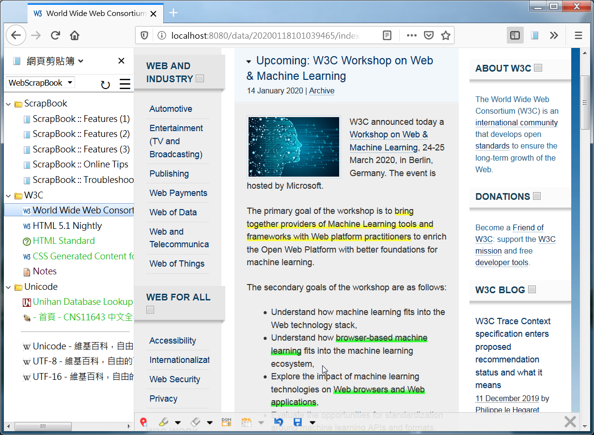

*WebScrapBook* is a browser extension that captures the web page faithfully with various archive formats and customizable configurations, for future retrieval, organization, annotation, and editing. This project inherits from legacy Firefox add-on [ScrapBook X](https://github.com/danny0838/firefox-scrapbook).

For further information and frequently asked questions, visit the [documentation wiki](https://github.com/danny0838/webscrapbook/wiki/Intro).

This extension is available for Chromium-based browsers ([Google Chrome](https://chrome.google.com/webstore/detail/web-scrapbook/oegnpmiddfljlloiklpkeelagaeejfai), [Edge](https://microsoftedge.microsoft.com/addons/detail/lodlipoddpmffbngkadebncbbidnambc), Opera, Vivaldi, etc.), and [Firefox for Desktop and Android](https://addons.mozilla.org/firefox/addon/webscrapbook).
